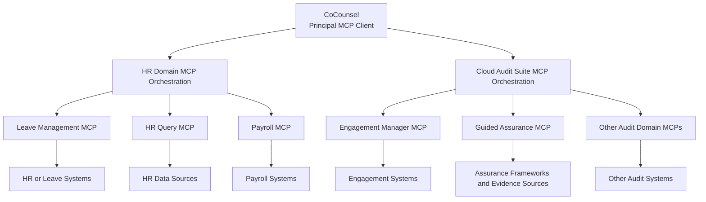

# MCP Leave Management

A local Model Context Protocol (MCP) server that simulates a leave management workflow for employees and managers. The server is designed for local demos, connector testing, and iterative MCP tool development with Claude Desktop.

It supports employee discovery, leave balance checks, leave application, manager review flows, full approvals, partial approvals, and rejections against a seeded in-memory dataset.

## Features

- MCP server over stdio using the official `@modelcontextprotocol/sdk`
- Employee and manager directory tools
- Leave application with date validation and balance checks
- Manager approval workflow scoped to the manager's own team
- Partial approval support with separate approved and rejected day counts
- Automatic leave balance deduction for approved days
- Seeded demo data across Engineering, Finance, and HR

## Tool Catalog

The server currently exposes these MCP tools:

| Tool | Purpose |
| --- | --- |
| `ping` | Health check for the MCP server |
| `list_all_employees` | List all people in the system, including managers with a position flag |
| `list_all_managers` | List managers only |
| `check_leave_balance` | Show available Annual, Sick, and Unpaid leave for a person |
| `apply_leave` | Submit a new leave request after validating dates and balance |
| `list_employee_leaves` | Show all leave requests for a specific person |
| `list_pending_approvals` | Show pending leave requests for a manager's direct team |
| `approve_leave` | Fully approve a pending leave request |
| `partial_approve_leave` | Approve part of a pending leave request and reject the remainder |
| `reject_leave` | Fully reject a pending leave request |

## Approval Rules

- Leave duration is calculated as inclusive days between `startDate` and `endDate`
- Dates must be in `YYYY-MM-DD` format
- End date cannot be earlier than start date
- Employees cannot submit leave beyond their available balance
- Managers cannot approve more leave days than the employee currently has available
- Managers can only review leave requests for employees who report to them directly
- Partial approvals deduct only the approved number of days from the employee's balance

## Seed Data

The demo dataset includes:

- 14 employees
- 7 managers
- Departments: Engineering, Finance, HR
- Sample names from multiple regions including Indian and Mexican names for demo variety

All data is stored in-memory in [src/data.ts](/c:/GitHub/AA_POC_Projects/MCP-Servers-POC/LeaveManagement/src/data.ts). Restarting the server resets all leave requests and balances back to the seeded state.

## Project Structure

```text
.
├── src/
│   ├── data.ts
│   └── index.ts
├── package.json
├── package-lock.json
├── tsconfig.json
└── README.md
```

## Prerequisites

- Node.js 18 or later
- npm
- Claude Desktop, if you want to test the server as an MCP connector

## Local Setup

Install dependencies:

```bash
npm install
```

Run a type check:

```bash
npm run check
```

Build the server:

```bash
npm run build
```

Run the compiled server:

```bash
npm start
```

Run the server directly from TypeScript during development:

```bash
npm run dev
```

## Claude Desktop Configuration

This server uses stdio transport. Claude Desktop should launch the process for you. You do not need to start the server manually before connecting it.

Example Claude Desktop MCP configuration:

```json
{
  "mcpServers": {
    "leave-management": {
      "command": "node",
      "args": [
        "C:/path/to/mcp-leave-management/dist/index.js"
      ]
    }
  }
}
```

Recommended workflow:

1. Run `npm run build`
2. Point Claude Desktop to `node` plus `dist/index.js`
3. Reconnect Claude Desktop after each rebuild when you want it to load the latest server code

## Development Notes

- The project is configured as an ESM package with `type: module`
- MCP SDK imports use explicit `.js` subpaths for correct runtime resolution in Node ESM
- `dev` uses `tsx` for a simpler local ESM TypeScript workflow
- `build` outputs compiled files to `dist/`

## Reference Architecture

This repository is a leaf MCP server in a broader enterprise MCP pattern. A high-level reference design is shown below, where `CoCounsel` acts as the principal MCP client and domain orchestration servers abstract their domain-specific MCP servers.



In this model:

- `CoCounsel` operates at the cross-domain layer
- domain orchestration servers expose business-oriented tool surfaces
- leaf MCP servers encapsulate focused systems and capabilities
- this leave management server fits under the HR domain orchestration layer

## Example Scenarios

### Employee flow

1. Call `list_all_employees`
2. Call `check_leave_balance` for a selected employee
3. Call `apply_leave`
4. Call `list_employee_leaves` to verify the request is pending

### Manager flow

1. Call `list_all_managers`
2. Call `list_pending_approvals` for a manager
3. Call `approve_leave`, `partial_approve_leave`, or `reject_leave`
4. Call `check_leave_balance` again to verify the resulting balance

## Limitations

- Data is in-memory only and is reset when the server restarts
- No persistence or database integration yet
- No authentication or role-based access beyond seeded manager-to-employee mappings
- Partial approvals are day-count based, not date-specific within a leave range

## Scripts

| Script | Description |
| --- | --- |
| `npm run dev` | Run the MCP server from TypeScript using `tsx` |
| `npm run check` | Run TypeScript type checking without emitting output |
| `npm run build` | Compile the server to `dist/` |
| `npm start` | Run the compiled server from `dist/index.js` |

## Tech Stack

- TypeScript
- Node.js
- `@modelcontextprotocol/sdk`
- `zod`