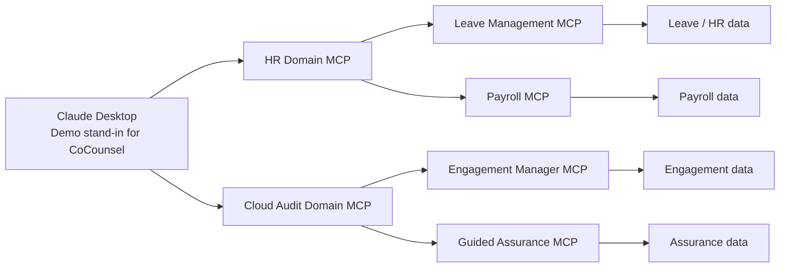

# MCP Reverse-Proxy Orchestration POC

## Architecture Overview

This demo models a reverse-proxy MCP orchestration pattern.

- `CoCounsel` is the intended principal MCP client in the target enterprise model.
- For this demo, `Claude Desktop` plays that role and connects directly to two domain MCP servers.
- Each domain MCP server proxies only its own leaf MCP servers.
- Each domain MCP server can also coordinate cross-leaf MCP work and return one business-level response.
- Leaf MCP servers stay focused on one system boundary and one tool family.



Why this architecture:

- smaller leaf MCPs are easier to own, change, and validate
- domain MCPs give one clean entry point per business domain
- the client does not need to understand every leaf server directly
- **the domain layer can combine relevant leaf responses into one domain-level answer, making the domain more powerful then just reverse proxy**
- transport boundaries stay explicit, which is closer to real enterprise integration

Pros of the reverse-proxy MCP orchestration model:

- better separation of concerns between client, domain, and system-level tools
- easier policy and access control at the domain boundary
- easier onboarding because users connect to a small number of domain servers
- easier leaf replacement or expansion without changing the client model
- more realistic handling of partial data overlap across systems

## Developers

Current packages:

- `apps/hr-domain-orchestrator-mcp` for the HR domain connector
- `apps/cloud-audit-suite-orchestrator-mcp` for the Cloud Audit domain connector
- `leaf-servers/leave-management-mcp` and `leaf-servers/payroll-mcp` under HR
- `leaf-servers/engagement-manager-mcp` and `leaf-servers/guided-assurance-mcp` under Cloud Audit

Root scripts:

- `npm run build` builds both domain stacks
- `npm run check` typechecks both domain stacks

Claude Desktop demo wiring:

```json
{
  "mcpServers": {
    "hr-domain-orchestrator-mcp": {
      "command": "node",
      "args": [
        "C:/path/to/LeaveManagement/apps/hr-domain-orchestrator-mcp/dist/index.js"
      ]
    },
    "cloud-audit-suite-orchestrator-mcp": {
      "command": "node",
      "args": [
        "C:/path/to/LeaveManagement/apps/cloud-audit-suite-orchestrator-mcp/dist/index.js"
      ]
    }
  }
}
```

Developer workflow:

1. Run `npm install` at the repo root.
2. Run `npm run build` at the repo root.
3. Point Claude Desktop to the two domain MCP servers.
4. Rebuild after code changes before reconnecting the client.